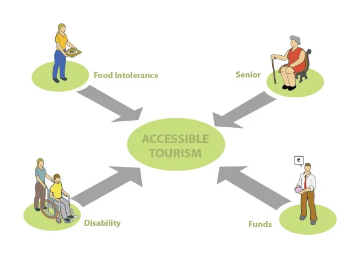

# curso2022-2

## Tarea para esta semana (1ago2022-5ago2022).

## Identificación de las necesidades
Con su grupo desarrollen el proceso de identificación de necesidades en torno al tema **Turismo Accsible** y suban a su repositorio el archivo "Identificacion-de-Necesidades.md" con los resultados de su investigación y discusión.

Pueden usar como guía el libro "BIODESIGN The Process of Innovating Medical Technologies" al cual pueden acceder desde [aquí](./Documentos/Biodesign-The-Process-of-Innovating-Medical-Technologies.pdf)